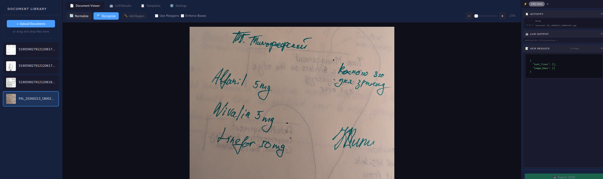
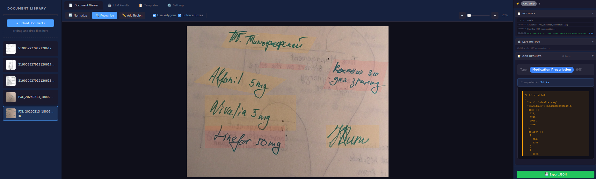
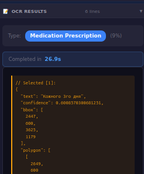
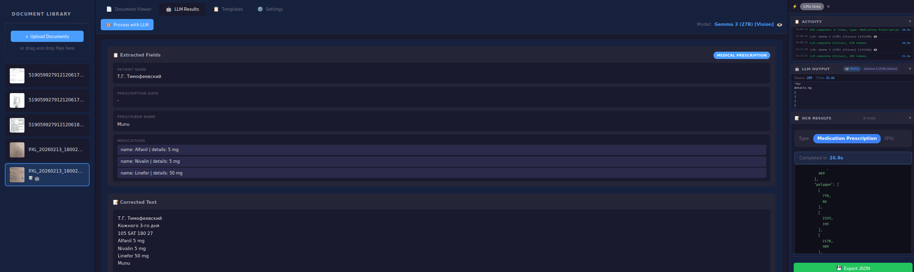
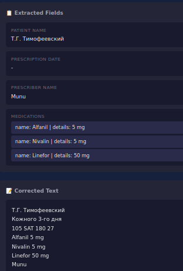
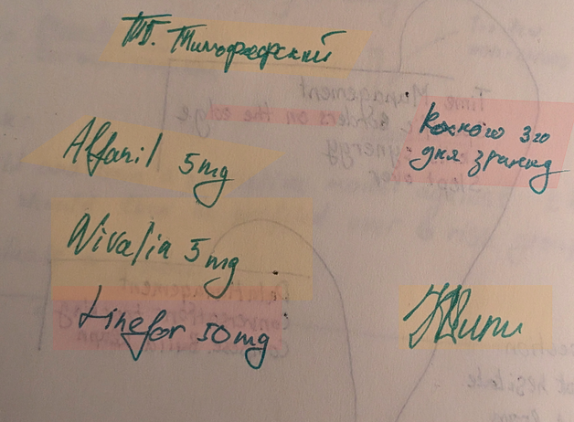
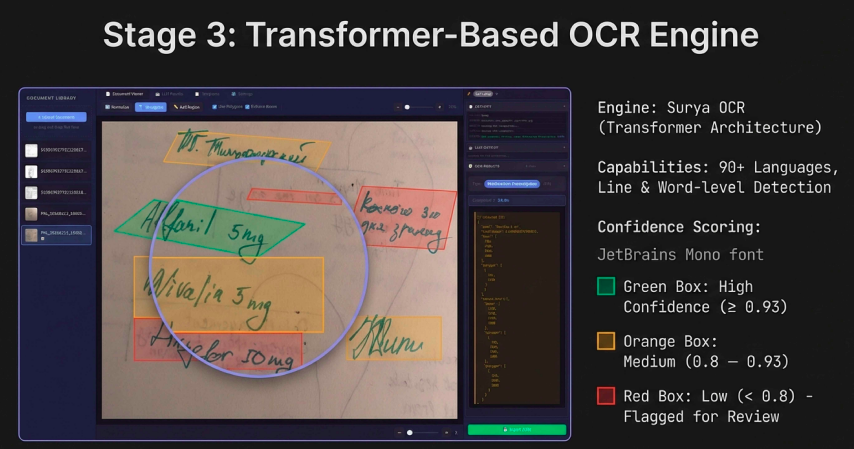
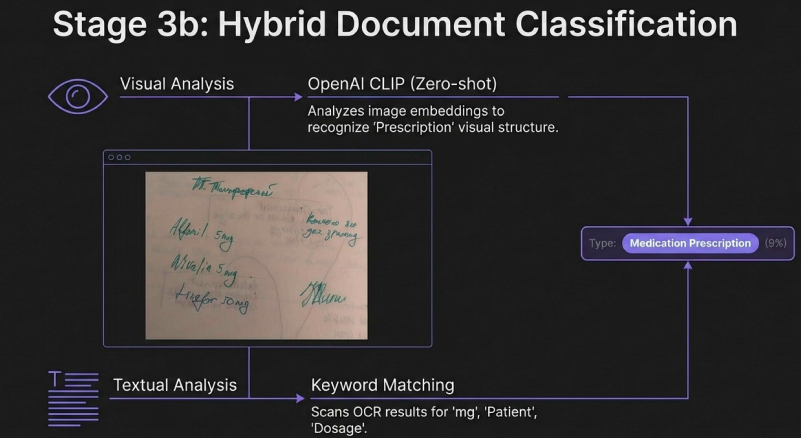
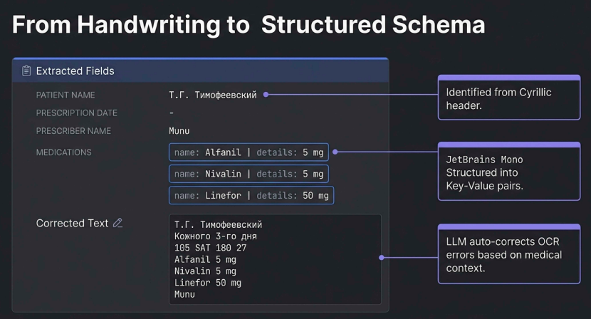

# Document Recognition System PoC with high level of security compliance
*Mini-POC using [Surya](https://github.com/datalab-to/surya). 
General idea is to be able to demo local inference capabilities and simplicity so that OCR can be practically done without external APIs.*

Observations:
* Text recognition speed on GB10 is appoximately 10 times faster than on Apple silicon (M3)
* Bounding boxes and recognition can be tunned by config AND finetuning
* Works well even for complex handwritten text for significant number of languages
* Can be integrated into claims processing pipelines easily
* Works on local machine, it is applicable for sensitive data processing so that you can comply with even very strict security standards in EU, UK and US including GDPR, ISO27001, FDA etc.
* Analysis of licensing terms, commercial use implications, and pricing for all software components shows that small business can afford this in most cases. See [COMPONENTS_LICENSE_OVERVIEW.md](COMPONENTS_LICENSE_OVERVIEW.md)
* Companies form domains like insurance, financial, healthcare and similar might be interested.


A local web application for document OCR (Optical Character Recognition) with image deskewing, text recognition, document classification, and **LLM-powered structured data extraction**.

## Features

### Core OCR Features
- **Image Upload**: Support for JPEG, PNG, TIFF, BMP formats
- **Deskewing**: Automatic document straightening using Projection Profile Analysis (OpenCV)
- **OCR Recognition**: Surya OCR with 90+ language support
- **Document Classification**: Hybrid CLIP + keyword-based classification
- **Interactive Editing**: Overlay for editing recognized text
- **Export**: Save results to JSON

### LLM Post-Processing with Multimodal Vision
- **Vision-Enabled LLMs**: Multimodal models (Gemma 3, LLaVA, Llama Vision) can see the document image directly
- **Combined Processing**: Image + OCR text processed together for superior accuracy
- **Local LLM Integration**: Ollama support for privacy-preserving inference
- **Multiple Models**: 
  - **Vision Models**: Gemma 3 27B/12B (default), LLaVA 34B/13B, Llama 3.2 Vision, MiniCPM-V
  - **Text Models**: Devstral 24B, Qwen 2.5, Meditron, MedGemma
- **Gemini Support**: Optional Google Gemini 2.5 Pro API with full vision capabilities
- **Structured Extraction**: Context-aware field extraction based on document type
- **Medical Domain Optimized**: Prompts tuned for medical terminology and drug names
- **Schema Templates**: YAML-based document schemas for customizable extraction

### Document Schema System (NEW)
- **Predefined Schemas**: Prescription, Receipt, Contract, Medical Form, etc.
- **Custom Schemas**: Create new document types via UI or YAML files
- **LLM Schema Generation**: Generate schemas from natural language descriptions
- **Field Types**: Text, date, currency, number, list (with nested items)

## Pipeline Demonstration

### Step 1: Document Upload


### Step 2: Image Deskewing


### Step 3: OCR Recognition


### Step 4: Text Overlay & Editing


### Step 5: LLM Processing


### Step 6: Structured Data Extraction


### Step 7: Advanced OCR Features


### Step 8: Region-Based Recognition


### Step 9: Text Recognition with Confidence Level


### Step 10: Document Type Classification and Proper Pipelining


### Step 11: Text Recognition + Medical-Aware Terminology Extraction


## Installation

```bash
# Clone the repository
cd document_recognition_local

# Create virtual environment
python -m venv venv
source venv/bin/activate  # Linux/Mac
# or
venv\Scripts\activate  # Windows

# Install PyTorch with GPU support (auto-detects platform)
chmod +x install_pytorch.sh
./install_pytorch.sh

# Install other dependencies
pip install -r requirements.txt
```

### Ollama Setup (for LLM features)

To use local LLM post-processing, install Ollama:

```bash
# Run the setup script (installs Ollama and pulls default model)
chmod +x setup_ollama.sh
./setup_ollama.sh

# Or install manually:
# macOS/Linux: curl -fsSL https://ollama.com/install.sh | sh
# Then pull a model: ollama pull devstral:24b
```

### Gemini API (Optional)

For Google Gemini 2.5 Pro support, set the API key:

```bash
export GEMINI_API_KEY="your-api-key-here"
```

When set, Gemini will appear as an available model in the Settings tab.

### GPU Acceleration

This application supports hardware acceleration on multiple platforms. PyTorch is installed separately from other dependencies to ensure the correct GPU-accelerated version is used for each platform.

#### Why Separate PyTorch Installation?

PyTorch wheels are platform-specific and require different package indices:
- **Standard PyPI** provides CPU-only wheels by default on most platforms
- **NVIDIA CUDA** requires wheels from PyTorch's CUDA-specific indices
- **DGX Spark** (Blackwell GB10) requires CUDA 13.0 wheels (`cu130`), which are different from standard NVIDIA GPUs

The `install_pytorch.sh` script automatically detects your hardware and installs the correct version.

#### Supported Platforms

| Platform | Architecture | Acceleration | PyTorch Source |
|----------|--------------|--------------|----------------|
| **Apple Silicon** (M1/M2/M3/M4) | arm64 (Darwin) | MPS (Metal) | Standard PyPI |
| **NVIDIA GPU** (desktop/server) | x86_64 | CUDA 12.1 | `cu121` index |
| **NVIDIA DGX Spark** | aarch64 + CUDA 13 | CUDA 13.0 | `cu130` index |
| **CPU only** | any | None | `cpu` index |

#### How Detection Works

The `install_pytorch.sh` script:
1. Detects OS and CPU architecture (`uname -m`)
2. Checks for NVIDIA GPU (`nvidia-smi`)
3. Detects CUDA version for DGX Spark (CUDA 13.x)
4. Installs the appropriate PyTorch wheels

#### Manual PyTorch Installation

If the script fails, install PyTorch manually based on your platform:

```bash
# Apple Silicon (MPS acceleration):
pip install torch torchvision

# NVIDIA GPU (x86_64, CUDA 12.x):
pip install torch torchvision --index-url https://download.pytorch.org/whl/cu121

# NVIDIA DGX Spark (aarch64, CUDA 13.0):
pip install torch torchvision --index-url https://download.pytorch.org/whl/cu130

# CPU only (no GPU):
pip install torch torchvision --index-url https://download.pytorch.org/whl/cpu
```

#### Verifying GPU Acceleration

After starting the server, check the console output:

```
============================================================
HARDWARE ACCELERATION DETECTION
============================================================
PyTorch Version: 2.x.x+cu130
CUDA Available: True
ACCELERATION: NVIDIA DGX/HPC (NVIDIA GB10)
...
```

The UI also displays acceleration status in the top-right panel.

**Note**: On first run, Surya OCR models will be downloaded automatically (~1.5GB). CLIP model (~150MB) downloads on first classification.

## Running

```bash
uvicorn app.main:app --reload --host 0.0.0.0 --port 8000
```

Open in browser: http://localhost:8000

## Usage

### Basic OCR Workflow
1. **Upload**: Click "Upload" or drag and drop images to the left panel
2. **Select**: Click on an image in the list
3. **Normalize**: Straighten a skewed document (optional)
4. **Recognize**: Run OCR recognition
5. **Edit**: Click on text in the overlay to edit
6. **Save**: Save results to a JSON file

### LLM Enhancement Workflow
1. Complete OCR recognition (steps 1-4 above)
2. Go to **Settings** tab → Select an LLM model (pull if needed)
   - **Vision models** (recommended): Gemma 3 27B, LLaVA - see the document image for best accuracy
   - **Text models**: Devstral, Qwen - process OCR text only
3. Go to **LLM Results** tab → Click "Process with LLM"
4. View extracted fields and corrected text
   - Vision models show `[Vision]` indicator when image was used

### Schema Management
1. Go to **Schema Templates** tab
2. View/edit existing schemas or create new ones
3. Use "Generate" to create schemas from natural language descriptions

## Project Structure

```
document_recognition_local/
├── app/
│   ├── main.py              # FastAPI application
│   ├── routers/api.py       # API endpoints
│   ├── config/
│   │   ├── document_schemas.py  # Schema loading and management
│   │   └── schemas/         # YAML document schemas
│   │       ├── prescription.yaml
│   │       ├── receipt.yaml
│   │       ├── contract.yaml
│   │       ├── medical_form.yaml
│   │       └── unknown.yaml
│   ├── services/
│   │   ├── ocr_service.py   # Surya OCR + CLIP classification
│   │   ├── image_service.py # Deskew with OpenCV
│   │   └── llm_service.py   # LLM clients (Ollama, Gemini)
│   ├── static/              # CSS, JS
│   └── templates/           # HTML
├── uploads/                 # Uploaded files
├── install_pytorch.sh       # Multi-platform PyTorch installer
├── setup_ollama.sh          # Ollama installation script
├── requirements.txt         # Python dependencies (excl. PyTorch)
├── TECHNICAL_SPEC.md        # Technical specification
├── DEVELOPER_GUIDE.md       # Developer guide with code examples
└── COMPONENTS_LICENSE_OVERVIEW.md  # Component licensing overview
```

## API

### Core Endpoints
| Endpoint | Method | Description |
|----------|--------|-------------|
| `/api/upload` | POST | Upload images |
| `/api/normalize` | POST | Deskew image |
| `/api/recognize` | POST | OCR recognition + classification |
| `/api/recognize-region` | POST | OCR on selected region |
| `/api/image/{id}` | GET | Retrieve image |

### LLM Endpoints
| Endpoint | Method | Description |
|----------|--------|-------------|
| `/api/llm/status` | GET | LLM service status, models, and vision capabilities |
| `/api/llm/process` | POST | Process with LLM (supports image_id for vision models) |
| `/api/llm/pull/{model_id}` | POST | Pull/download Ollama model (streaming) |

### Schema Endpoints
| Endpoint | Method | Description |
|----------|--------|-------------|
| `/api/schemas` | GET | List all document schemas |
| `/api/schemas/{type_id}` | GET | Get schema by type ID |
| `/api/schemas/{type_id}` | PUT | Update schema |
| `/api/schemas/{type_id}` | DELETE | Delete schema |
| `/api/schemas/generate` | POST | Generate schema with LLM |
| `/api/schemas/generate/stream` | POST | Generate schema with streaming output |

## Requirements

- Python 3.10+
- PyTorch 2.0+ (installed via `install_pytorch.sh`)
- ~4GB RAM recommended for all models
- Ollama (optional, for local LLM features)
- Gemini API key (optional, for cloud LLM)

### Hardware Requirements by Platform

| Platform | GPU Memory | System RAM | Notes |
|----------|------------|------------|-------|
| Apple Silicon | Unified | 8GB+ | Uses Metal Performance Shaders |
| NVIDIA GPU | 4GB+ VRAM | 8GB+ | CUDA 12.x or 13.x |
| DGX Spark | 128GB unified | - | Blackwell GB10, CUDA 13.0 |
| CPU only | - | 8GB+ | Slower inference |

### LLM Model Requirements

| Model | VRAM/RAM | Vision | Notes |
|-------|----------|--------|-------|
| **Gemma 3 27B** | ~18GB | Yes | **Default** - best vision + quality |
| Gemma 3 12B | ~10GB | Yes | Smaller vision model |
| LLaVA 34B | ~22GB | Yes | High accuracy multimodal |
| LLaVA 13B | ~10GB | Yes | Balanced multimodal |
| Llama 3.2 Vision | ~8GB | Yes | Meta's vision model |
| MiniCPM-V 8B | ~6GB | Yes | Efficient vision model |
| Devstral 24B | ~16GB | No | Text-only, high quality |
| Qwen 2.5 7B | ~6GB | No | Good balance of speed/quality |
| Meditron 7B | ~6GB | No | Medical domain specialized |
| Gemini 2.5 Pro | Cloud | Yes | Requires API key, full vision |

## Document Schemas

Document schemas define how to extract structured data from different document types. Schemas are stored as YAML files in `app/config/schemas/`.

### Schema Structure

```yaml
type_id: prescription          # Unique identifier
display_name: Medical Prescription  # Human-readable name

clip_prompts:                  # CLIP classification prompts
  - "a medical prescription document"

keywords:                      # Text-based classification keywords
  - rx
  - medication
  - dosage

llm_context: |                 # Instructions for LLM extraction
  This is a MEDICAL PRESCRIPTION. Extract medications with dosages.

fields:                        # Fields to extract
  - name: patient_name
    type: text
    description: "Patient's full name"
    required: true
  - name: medications
    type: list
    description: "List of medications with dosage and instructions"
    required: true
```

### Available Field Types
- `text` - Plain text string
- `date` - Date value (YYYY-MM-DD)
- `currency` - Monetary amount
- `number` - Numeric value
- `list` - Array of items (e.g., medications, line items)

## Documentation

- **[ARCHITECTURE.md](ARCHITECTURE.md)** - Detailed technical architecture (for articles/infographics)
- **[TECHNICAL_SPEC.md](TECHNICAL_SPEC.md)** - Complete technical specification
- **[DEVELOPER_GUIDE.md](DEVELOPER_GUIDE.md)** - Developer guide with code examples
- **[COMPONENTS_LICENSE_OVERVIEW.md](COMPONENTS_LICENSE_OVERVIEW.md)** - Component licensing overview
