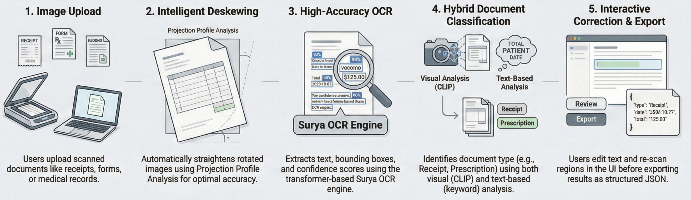

# Document Recognition System 
*Mini-POC using [Surya](https://github.com/datalab-to/surya). General idea is to be able to demo local inference capabilities and simplicity so that OCR can be practically done without external APIs.*



A local web application for document OCR (Optical Character Recognition) with image deskewing, text recognition, and document classification.

## Features

- **Image Upload**: Support for JPEG, PNG, TIFF, BMP formats
- **Deskewing**: Automatic document straightening using Projection Profile Analysis (OpenCV)
- **OCR Recognition**: Surya OCR with 90+ language support
- **Document Classification**: Hybrid CLIP + keyword-based classification
- **Interactive Editing**: Overlay for editing recognized text
- **Export**: Save results to JSON

## Installation

```bash
# Clone the repository
cd document_recognition_local

# Create virtual environment
python -m venv venv
source venv/bin/activate  # Linux/Mac
# or
venv\Scripts\activate  # Windows

# Install PyTorch with GPU support (auto-detects platform)
chmod +x install_pytorch.sh
./install_pytorch.sh

# Install other dependencies
pip install -r requirements.txt
```

### GPU Acceleration

This application supports hardware acceleration on multiple platforms. PyTorch is installed separately from other dependencies to ensure the correct GPU-accelerated version is used for each platform.

#### Why Separate PyTorch Installation?

PyTorch wheels are platform-specific and require different package indices:
- **Standard PyPI** provides CPU-only wheels by default on most platforms
- **NVIDIA CUDA** requires wheels from PyTorch's CUDA-specific indices
- **DGX Spark** (Blackwell GB10) requires CUDA 13.0 wheels (`cu130`), which are different from standard NVIDIA GPUs

The `install_pytorch.sh` script automatically detects your hardware and installs the correct version.

#### Supported Platforms

| Platform | Architecture | Acceleration | PyTorch Source |
|----------|--------------|--------------|----------------|
| **Apple Silicon** (M1/M2/M3/M4) | arm64 (Darwin) | MPS (Metal) | Standard PyPI |
| **NVIDIA GPU** (desktop/server) | x86_64 | CUDA 12.1 | `cu121` index |
| **NVIDIA DGX Spark** | aarch64 + CUDA 13 | CUDA 13.0 | `cu130` index |
| **CPU only** | any | None | `cpu` index |

#### How Detection Works

The `install_pytorch.sh` script:
1. Detects OS and CPU architecture (`uname -m`)
2. Checks for NVIDIA GPU (`nvidia-smi`)
3. Detects CUDA version for DGX Spark (CUDA 13.x)
4. Installs the appropriate PyTorch wheels

#### Manual PyTorch Installation

If the script fails, install PyTorch manually based on your platform:

```bash
# Apple Silicon (MPS acceleration):
pip install torch torchvision

# NVIDIA GPU (x86_64, CUDA 12.x):
pip install torch torchvision --index-url https://download.pytorch.org/whl/cu121

# NVIDIA DGX Spark (aarch64, CUDA 13.0):
pip install torch torchvision --index-url https://download.pytorch.org/whl/cu130

# CPU only (no GPU):
pip install torch torchvision --index-url https://download.pytorch.org/whl/cpu
```

#### Verifying GPU Acceleration

After starting the server, check the console output:

```
============================================================
HARDWARE ACCELERATION DETECTION
============================================================
PyTorch Version: 2.x.x+cu130
CUDA Available: True
ACCELERATION: NVIDIA DGX/HPC (NVIDIA GB10)
...
```

The UI also displays acceleration status in the top-right panel.

**Note**: On first run, Surya OCR models will be downloaded automatically (~1.5GB). CLIP model (~150MB) downloads on first classification.

## Running

```bash
uvicorn app.main:app --reload --host 0.0.0.0 --port 8000
```

Open in browser: http://localhost:8000

## Usage

1. **Upload**: Click "Upload" or drag and drop images to the left panel
2. **Select**: Click on an image in the list
3. **Normalize**: Straighten a skewed document (optional)
4. **Recognize**: Run OCR recognition
5. **Edit**: Click on text in the overlay to edit
6. **Save**: Save results to a JSON file

## Project Structure

```
document_recognition_local/
├── app/
│   ├── main.py              # FastAPI application
│   ├── routers/api.py       # API endpoints
│   ├── services/
│   │   ├── ocr_service.py   # Surya OCR + CLIP classification
│   │   └── image_service.py # Deskew with OpenCV
│   ├── static/              # CSS, JS
│   └── templates/           # HTML
├── uploads/                 # Uploaded files
├── install_pytorch.sh       # Multi-platform PyTorch installer
├── requirements.txt         # Python dependencies (excl. PyTorch)
├── TECHNICAL_SPEC.md        # Technical specification
├── DEVELOPER_GUIDE.md       # Developer guide with code examples
└── LICENSE_AND_PRICING.md   # Licensing and pricing analysis
```

## API

| Endpoint | Method | Description |
|----------|--------|-------------|
| `/api/upload` | POST | Upload images |
| `/api/normalize` | POST | Deskew image |
| `/api/recognize` | POST | OCR recognition + classification |
| `/api/recognize-region` | POST | OCR on selected region |
| `/api/image/{id}` | GET | Retrieve image |

## Requirements

- Python 3.10+
- PyTorch 2.0+ (installed via `install_pytorch.sh`)
- ~4GB RAM recommended for all models

### Hardware Requirements by Platform

| Platform | GPU Memory | System RAM | Notes |
|----------|------------|------------|-------|
| Apple Silicon | Unified | 8GB+ | Uses Metal Performance Shaders |
| NVIDIA GPU | 4GB+ VRAM | 8GB+ | CUDA 12.x or 13.x |
| DGX Spark | 128GB unified | - | Blackwell GB10, CUDA 13.0 |
| CPU only | - | 8GB+ | Slower inference |

## Documentation

- **[TECHNICAL_SPEC.md](TECHNICAL_SPEC.md)** - Complete technical specification
- **[DEVELOPER_GUIDE.md](DEVELOPER_GUIDE.md)** - Developer guide with code examples
- **[LICENSE_AND_PRICING.md](LICENSE_AND_PRICING.md)** - Licensing and pricing analysis
